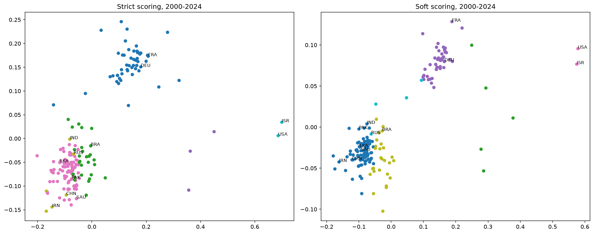
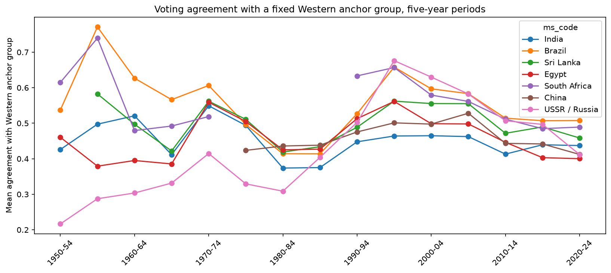

# UN General Assembly Voting Explorer

An exploration of how countries vote at the UN General Assembly: a data pipeline over about 947,000 recorded votes, a measure of voting similarity between countries, clustering of countries, and a look at how agreement with a Western anchor group has changed since 1950. Work in progress.

## Status

- [x] Data download, validation, and preparation (`src/prepare.py`)
- [x] Exploratory analysis of the vote data
- [x] Country-to-country agreement measure, with two ways of scoring abstentions
- [x] Clustering of countries (2000-2024) and a choice of cluster count based on evidence
- [x] First version of the time analysis (agreement with a fixed Western anchor group, 1950-2024)
- [ ] Interactive app: compare any two countries
- [ ] Move shared functions from the notebooks into `src/votes.py`

## Data

UN Digital Library recorded votes on General Assembly resolutions (version 5, February 2026): 947,434 country votes on 5,694 resolutions adopted by recorded vote, from January 1946 to December 2025, covering 202 country codes.

* Only resolutions adopted by a recorded vote are included. Most resolutions pass without a vote, and votes on paragraphs or on drafts that failed are not in this dataset.
* Vote codes: Y (yes), N (no), A (abstain), X (non-voting).
* The raw file is 364 MB and is not stored in this repository.

Source: United Nations Dag Hammarskjöld Library, *General Assembly Voting Data*, United Nations, version 5 (February 2026), downloaded from the [UN Digital Library](https://digitallibrary.un.org/record/4060887). Non-commercial use with attribution.

## Method

1. **Prepare** (`src/prepare.py`): split the raw file into three tables (votes, resolutions, countries). Votes are coded yes = 1, abstain = 0, no = -1; non-voting is treated as missing, not as a neutral position.
2. **Agreement**: for each pair of countries, a score over the resolutions both voted on. Pairs with fewer than 20 shared votes are ignored. Two versions:
   * **Strict:** the share of shared votes where both cast the same vote (yes against abstain counts as disagreement).
   * **Soft:** yes against abstain counts as half agreement; yes against no counts as full disagreement.
3. **Cluster**: convert agreement to distance, place countries on a five-dimensional map with multidimensional scaling (fixed random seed), and group them with Ward hierarchical clustering. Only countries that voted on at least 70% of the resolutions in the window are included (176 countries for 2000-2024).
4. **Choose the number of clusters** with silhouette scores, in several windows and with and without the most extreme countries.
5. **Time analysis**: for each five-year period from 1950-54 to 2020-24, each country's mean strict agreement with a fixed anchor group (United Kingdom, France, Canada, Australia, Netherlands, Belgium, Norway, Denmark). The United States is left out of the anchors on purpose.

Country codes (`ms_code`) are treated as continuous across renames and changes of government. Predecessor and successor states (for example the USSR and Russia) are linked in a separate lookup column and are not merged.

## Findings so far

### 2025 has an unusual number of recorded votes
Session 80 contains 159 recorded-vote resolutions, against 113 in session 79. In 2025 as a whole, 124 of 192 recorded-vote resolutions had three or fewer "no" votes, up from 33 of 95 in 2024. The United States cast a "no" vote on 114 of those 124 (92%), Argentina on 45, and Israel on 44. The increase is spread across many subjects and is not tied to Middle East resolutions, whose yearly count stayed between 9 and 16 from 2015 to 2025. I report this as an observed pattern and did not investigate its causes.

### Pairwise agreement is more reliable than cluster labels
For 2000-2024, agreement between selected pairs (about 2,000 shared votes each; rank is among 175 other countries, 1 = closest):

| Pair | Agreement (strict / soft) | Rank (strict / soft) |
| :--- | :---: | :---: |
| India - Pakistan | 0.86 / 0.92 | 1 / 1 |
| India - Sri Lanka | 0.82 / 0.89 | 4 / 4 |
| Pakistan - China | 0.87 / 0.93 | 2 / 5 |
| India - China | 0.79 / 0.88 | 39 / 20 |
| China - Russia | 0.76 / 0.86 | 106 / 100 |
| India - Russia | 0.68 / 0.81 | 116 / 115 |
| India - France | 0.43 / 0.61 | 167 / 167 |
| India - USA | 0.16 / 0.28 | 175 / 175 |

A seven-country group (China, India, Pakistan, Iran, Russia, Syria, North Korea) appeared under strict scoring in one six-cluster run, but the table shows it is not a tight bloc: China ranks 39th among India's partners and Russia 116th. Under soft scoring, Russia separates from China and India.

### Number of clusters
Silhouette scores (higher means better-separated groups):

| Setup | Countries | k=2 | k=3 | k=4 | k=5 | k=6 | k=7 | k=8 |
| :--- | :---: | :---: | :---: | :---: | :---: | :---: | :---: | :---: |
| 2000-2024, strict | 176 | 0.67 | 0.69 | 0.42 | 0.42 | 0.42 | 0.39 | 0.37 |
| 2000-2024, soft | 176 | 0.72 | 0.73 | 0.72 | 0.43 | 0.42 | 0.40 | 0.40 |
| 1980-1989, strict | 146 | 0.71 | 0.65 | 0.40 | 0.41 | 0.35 | 0.36 | 0.35 |
| 2010-2024, strict | 181 | 0.67 | 0.67 | 0.45 | 0.44 | 0.44 | 0.43 | 0.33 |
| 2000-2024, strict, outliers removed | 171 | 0.70 | 0.48 | 0.44 | 0.36 | 0.33 | 0.34 | 0.24 |
| 2000-2024, soft, outliers removed | 171 | 0.76 | 0.43 | 0.42 | 0.39 | 0.31 | 0.32 | 0.30 |

The outliers are the United States, Israel, Micronesia, the Marshall Islands, and Palau. With them included, the best scores are at two and three groups. With three groups the split is a Western and European group (50 countries), the United States with Israel and the three Pacific states (5), and all other countries (121). Removing the five outliers leaves the two-group division intact (the score rises to 0.70 strict and 0.76 soft) and leaves no clear structure beyond it, so the high k=3 score partly reflected the extreme countries.

The one clear division is therefore a Western and European group of about 50 countries against all others. Finer splits, such as a Latin American-centred group of 28 countries in a six-group solution, are descriptions of a continuum and not distinct blocs. Under soft scoring, Australia and Canada sit with the Pacific states and not the main Western group; I did not investigate why.



*Voting map, 2000-2024. Axes have no meaning; only distances between countries do. The two panels cannot be compared by position.*

### Agreement with a Western anchor group over time


* **The USSR and Russia show the largest change.** Agreement with the anchor group was about [0.31] in 1980-84, rose to about [0.68] in 1995-99, and fell back to about [0.41] in 2020-24.
* **Most of the other countries shown follow a similar shape**: lower in 1980-89 than in 1970-74, a peak in the late 1990s, and lower again by 2020-24 than in 1995-99. India and China move much less than the others.
* **South Africa has no line from 1975-79 to 1985-89** because the data does not show enough shared votes in those periods.
* The early periods have far fewer votes: 74 resolutions in 1950-54 against about 710 in each of 1980-84 and 1985-89, and 360 to 460 in each period since 1990. Early points are rough.
* I describe these patterns and did not investigate their causes. Recorded votes depend on which resolutions were put to a vote, which also changed over time.

## Limitations

* Recorded votes are not a random sample of all resolutions, because most pass by consensus without a vote.
* Agreement reflects similar votes on recorded-vote resolutions, not alliances or relations.
* Cluster results depend on the number of groups chosen, the time window, and how abstentions are scored. Most countries outside the Western group and the five outliers form a continuous cloud, so boundaries within it are somewhat arbitrary.
* Silhouette scores are a rule of thumb, and small extreme groups can raise them.
* The anchor group in the time analysis is a choice of eight countries and is not a neutral reference.
* The dataset uses one code for the Chinese seat throughout. The seat changed from the Republic of China to the People's Republic of China in 1971, so China's line starts in 1975-79.
* The USSR/Russia line joins two codes. The 1990-94 point uses the Soviet Union's 1990-91 votes only, because the Soviet value is preferred when both exist.
* Country-code continuity across renames is an assumption; Yemen's code spans North Yemen and the unified state after 1990.
* No significance tests have been run, and 2025 is unusual enough that windows including it should be read with care. The time analysis stops at 2024.

## Next steps

1. Move the agreement and clustering functions from the notebooks into `src/votes.py`.
2. Build a small Streamlit app: pick two countries, see their agreement over time and each country's closest voting partners.
3. Plot the Soviet Union and Russia as separate series.
4. Run the time analysis with the soft agreement scoring and compare.

## How to run

```bash
git clone https://github.com/DeepCover-spec/un-voting-explorer.git
cd un-voting-explorer
python -m venv .venv
.venv\Scripts\activate        # Mac/Linux: source .venv/bin/activate
pip install -r requirements.txt
```

Download `2026_02_06_ga_voting.csv` from the [UN Digital Library](https://digitallibrary.un.org/record/4060887) into `data/raw/`, then:

```bash
python src/prepare.py
```

Run the notebooks in `notebooks/` in order.